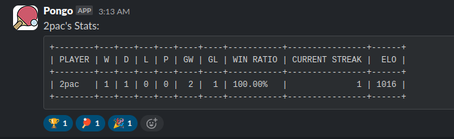

# Pingo-Pongo 🏓

Pingo-Pongo is a tool for tracking ping pong scores, player stats and leaderboards. It also supports registering webhooks on leaderboards, enabling members to receive notifications about match results and leaderboard changes.

- **API**: `pongo` - Manage scores, leaderboards, players, and webhooks programatically.
- **CLI**: `pingo` - Interact with the API from the command line.

## Installation

### CLI (`pingo`)

1. Download the latest binary from the [Releases](https://github.com/6ixfigs/pingopongo/releases) page.
2. Make the binary executable:

```bash
chmod +x pingo
```

3. Move the binary to a directory in your `PATH` (Optional):

```bash
mv pingo /usr/local/bin/
```

4. Verify the installation:

```bash
pingo version
```

### API (`pongo`)

1. Clone the repository:

```bash
git clone https://github.com/6ixfigs/pingopongo.git
cd pingopongo
```

2. Configure `.env` based on `.env.template`.

3. Start the services using `docker compose` or `make`:

```bash
docker compose up -d --build # or: make up
```

4. Apply database migrations:

```bash
docker compose --profile tools run --rm migrate up # or: make migrate-up
```

## CLI Usage

The `pingo` CLI allows you to interact with the Pongo API from the command line.

```bash
$ pingo
CLI for interacting with the Pongo server

Usage:
  pingo [command]

Available Commands:
  help        Help about any command
  leaderboard Create or retrieve leaderboards
  player      Create a player or retrieve stats
  record      Record a match between two players
  version     Print Pingo version number
  webhooks    Manage webhooks

Flags:
  -h, --help   help for pingo

Use "pingo [command] --help" for more information about a command.
```

### Example Flow

Create leaderboard `OnlyRealGs`:

```bash
$ pingo leaderboard create OnlyRealGs
Please enter base URL of pongo host: http://localhost:8080 # prompted only the first time using pingo
Base URL saved at  /home/realg/.config/pingo.cfg
200 OK
Created leaderboard: OnlyRealGs
```

Add players to `OnlyRealGs`:

```bash
$ pingo player create OnlyRealGs 2pac
200 OK
Created player on leaderboard OnlyRealGs: 2pac
$ pingo player create OnlyRealGs eazy-e
200 OK
Created player on leaderboard OnlyRealGs: eazy-e
$ pingo player create OnlyRealGs snoop
200 OK
Created player on leaderboard OnlyRealGs: snoop
$ pingo player create OnlyRealGs dre
200 OK
Created player on leaderboard OnlyRealGs: dre
$ pingo leaderboard get OnlyRealGs
200 OK
Leaderboard OnlyRealGs:
+---+--------+---+---+---+---+-----------+------+
| # | PLAYER | W | D | L | P | WIN RATIO |  ELO |
+---+--------+---+---+---+---+-----------+------+
| 1 | 2pac   | 0 | 0 | 0 | 0 | 0.00%     | 1000 |
| 2 | dre    | 0 | 0 | 0 | 0 | 0.00%     | 1000 |
| 3 | eazy-e | 0 | 0 | 0 | 0 | 0.00%     | 1000 |
| 4 | snoop  | 0 | 0 | 0 | 0 | 0.00%     | 1000 |
+---+--------+---+---+---+---+-----------+------+
```

Record a match:

```bash
$ pingo record OnlyRealGs 2pac eazy-e 2-1
200 OK
Match recorded: (+16) 2pac 2 - 1 eazy-e (-16) !
```

Register a Slack webhook:

```bash
$ pingo webhooks register OnlyRealGs https://hooks.slack.com/services/*******/***********
200 OK
Registered new webhook on leaderboard OnlyRealGs: https://hooks.slack.com/services/*******/***********
```

View `2pac`'s stats in the command-line...

```bash
$ pingo player stats OnlyRealGs 2pac
200 OK
2pac's Stats:
+--------+---+---+---+---+----+----+-----------+----------------+------+
| PLAYER | W | D | L | P | GW | GL | WIN RATIO | CURRENT STREAK |  ELO |
+--------+---+---+---+---+----+----+-----------+----------------+------+
| 2pac   | 1 | 1 | 0 | 0 |  2 |  1 | 100.00%   |              1 | 1016 |
+--------+---+---+---+---+----+----+-----------+----------------+------+
```

...and now in Slack as well:




## API Usage

The `pongo` API provides endpoints for managing scores, players, leaderboards and webhooks. Refer to the [API Documentation](docs/API.md) for details.

## Contributing

We welcome contributions! Please read the [Contribution Guidelines](CONTRIBUTING.md) to get started.

## License

This project is licensed under the MIT License. See [LICENSE](LICENSE.md) for details.
